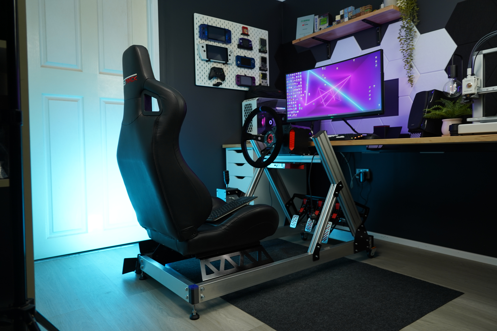
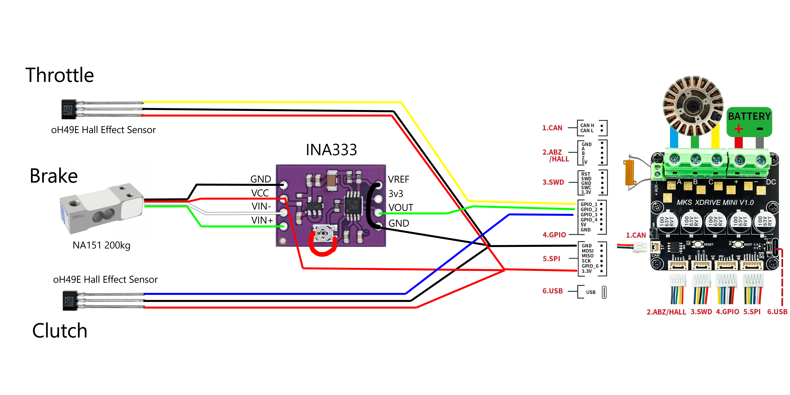

# CNCDan - DIY Sim Rig

This project is part of my DIY Sim racing series. This sim rig is designed to work with all of my DIY sim racing accessories along with a any seat with rail hole spacing of 357x300mm (Width x Length).

The seat I used is from a Next Level Racing GTRacer 2.0. If you find a seat that is compatible with this design without any modifications, let me know and I will include a list of compatible models!

Be cautious with the steering bar brackets. The cut file is the same for both sides but you will need to countersink the holes on opposite sides so you have a mirrored pair of plates. I have uploaded a .STEP file for both so you can see what I mean.

If you decide to make the flat brackets yourself by hand, you should be able to open the DXF files and print them at 1:1 scale onto paper to use as a template. You could also 3D print the .STEP files and use them as a template.

Here's the wiring diagram to connect the Pedals to the FFBeast Wheel:

The order of the GPIO connections doesn't matter, just map the pedals as the correct inputs in the game and you'll be set!

If you want to build the whole set, here are the links to the other projects featured in this video!

Shifter: https://github.com/dmcke5/H-Shifter

Pedals: https://github.com/dmcke5/SimPedals

Wheel: https://github.com/dmcke5/FFBeast-Wheel

Finally, here's a link to the INA333 board I used to get the load cell working with the FFBeast wheel: https://www.aliexpress.com/item/1005007130064459.html

Link to video:

#### Bill of Materials

2m of 8040 Extrusion

1m of 4040 Extrusion

3.5m of 70x30x3 Aluminium RHS

#### Nuts, Bolts and Washers

34x M5 4040 T-Nuts

50x M5x16 SHCS

50x M5 Washers

16x M8x40 Hex Head Bolts

4x M8x20 Hex Head Bolts

20x M8 Nyloc Nuts

36x M8 Washers

